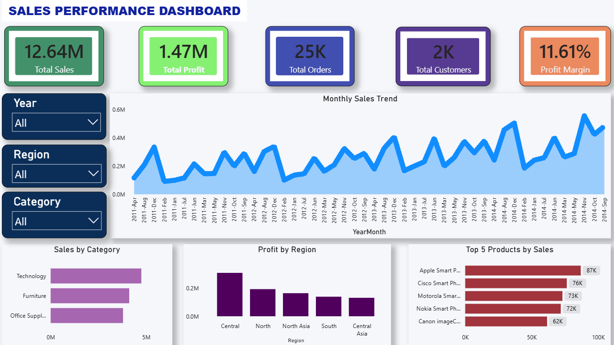

# Retail Sales Analytics Dashboard

## Project Overview

Retail organizations generate massive volumes of transactional data across products, customers, and regions. However, transforming this raw data into actionable business insights remains a challenge.

This project focuses on analyzing sales performance, profitability, customer activity, and product trends using Power BI. The dashboard provides a centralized view of key business metrics, enabling stakeholders to track performance, identify growth opportunities, and support data-driven decision-making.

---

## Business Problem

Retail businesses often struggle to answer critical questions such as:

* Which product categories contribute the most revenue?
* Which regions generate the highest profit?
* How are sales performing over time?
* Which products drive the largest share of revenue?
* How can management monitor business performance through a single reporting solution?

This dashboard was developed to provide a consolidated analytics platform that helps decision-makers monitor sales performance and uncover business trends efficiently.

---

## Dataset Information

**Dataset:** Global Superstore Dataset

### Data Scope

* Records Analyzed: 51,290+
* Unique Orders: 25,000+
* Customers: 2,000+
* Time Period: 2011 – 2014
* Multiple Product Categories and Regions

### Key Attributes

* Order Information
* Customer Information
* Product Details
* Sales
* Profit
* Quantity
* Discount
* Shipping Cost
* Region
* Category & Sub-Category

---

## Tools & Technologies Used

### Power BI

* Interactive Dashboard Development
* Data Modeling
* DAX Measures
* KPI Reporting

### Power Query

* Data Cleaning
* Data Transformation
* Data Validation

### Data Modeling

* Custom Date Table
* Relationship Management
* Time-Based Analysis

---

## Data Preparation & Transformation

To ensure reliable analysis, the dataset underwent multiple preprocessing steps:

* Removed records with missing Postal Codes
* Validated and standardized date fields
* Created a custom Date Table for time intelligence analysis
* Established relationships between transactional and date data
* Generated Delivery Days metric using Order Date and Ship Date
* Optimized data model for dashboard performance

---

## Key Performance Indicators (KPIs)

The dashboard tracks the following business metrics:

* Total Sales: **12.64M**
* Total Profit: **1.47M**
* Profit Margin: **11.61%**
* Total Orders: **25K+**
* Total Customers: **2K+**

---

## Dashboard Features

### Executive Performance Monitoring

Provides an at-a-glance overview of overall business performance using KPI cards.

### Monthly Sales Trend Analysis

Tracks revenue performance over time and highlights sales growth patterns across multiple years.

### Category Performance Analysis

Compares sales contribution across product categories to identify top-performing business segments.

### Regional Profitability Analysis

Evaluates profit distribution across regions to identify high-performing and underperforming markets.

### Top Product Analysis

Highlights the highest revenue-generating products, enabling focused inventory and sales strategies.

### Interactive Filtering

Users can dynamically analyze data using:

* Year Filters
* Region Filters
* Category Filters

---

## Key Business Insights

* The business generated over **12.64 million** in sales during the analysis period.
* More than **25,000 customer orders** were processed across multiple global markets.
* Overall profitability reached **1.47 million**, resulting in an **11.61% profit margin**.
* Product category analysis revealed significant differences in revenue contribution across categories.
* Regional performance analysis highlighted varying profit levels across business markets.
* A small group of top-performing products contributed a substantial portion of overall revenue.
* Sales performance demonstrated consistent growth opportunities across the analyzed period.

---

## Business Impact

This dashboard enables retail decision-makers to:

* Monitor sales and profitability in real time
* Identify high-performing product categories
* Evaluate regional business performance
* Improve strategic planning and resource allocation
* Support data-driven decision making
* Reduce reporting effort through automated visualization

---

## Outcome

* Analyzed **51K+ retail transaction records**
* Evaluated **25K+ customer orders**
* Monitored **12.64M total sales**
* Tracked **1.47M total profit**
* Measured **11.61% profit margin**
* Enabled analysis across multiple regions, categories, and years through interactive reporting

---

## Dashboard Preview

---

## Author

**Shubham Singh**

Power BI | Excel | SQL | Data Analytics
